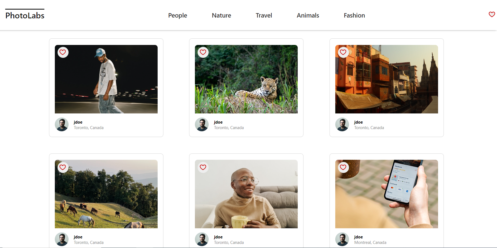
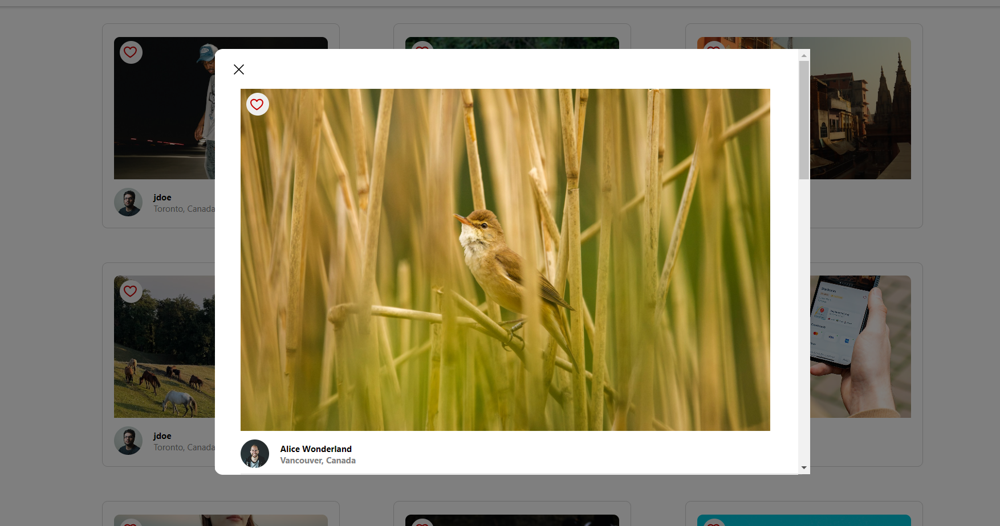

# react-photolabs
The PhotoLabs project for the Web Development React course programming.

# Photolabs

## Setup

Install dependencies with `npm install` in each respective `/frontend` and `/backend`.

## [Frontend] Running Webpack Development Server

```sh
cd frontend
npm start
```

## [Backend] Running Backend Servier

Read `backend/readme` for further setup details.

```sh
cd backend
npm start
```

## Screenshots




## Dependencies

- React version 18.2
- Express
- Node.js 12.22 or above
- Body-parser
- Cors
- PSQL version 8.5
- Dotenv